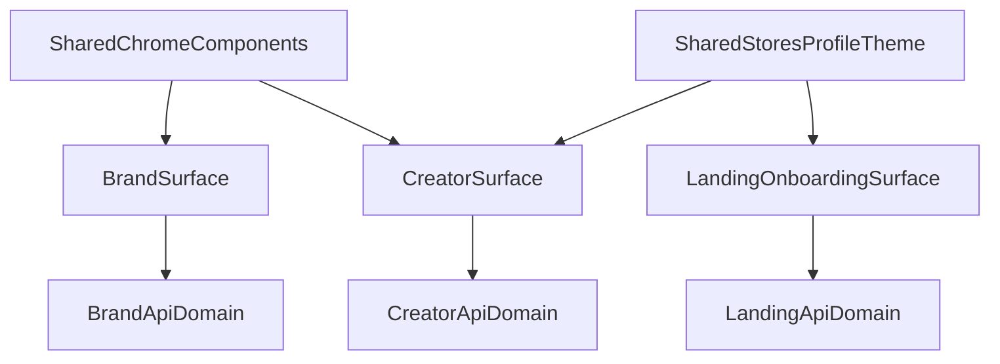
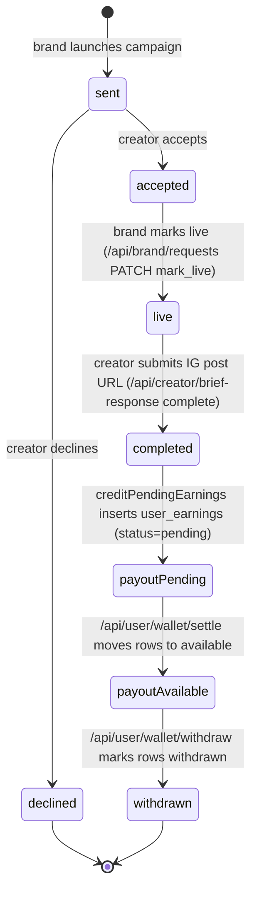

# Surface Ownership Map

This document maps the current production-aligned ownership model across Landing, Creator, and Brand surfaces.

## 1) Surface Responsibilities

## Landing + Onboarding

- Entry, auth handoff, and profile bootstrap.
- Primary files:
  - `src/routes/+page.svelte`
  - `src/routes/onboarding/+page.svelte`
  - `src/routes/auth/*`

## Creator

- Authenticated creator workspace (home/profile/earn).
- Primary files:
  - `src/routes/(app)/+layout.svelte`
  - `src/routes/(app)/home/+page.svelte`
  - `src/routes/(app)/profile/+page.svelte`
  - `src/routes/(app)/earn/+page.svelte`

## Brand

- Brand discovery, login, portal, and creators list.
- Primary files:
  - `src/routes/brands/+layout.svelte`
  - `src/routes/brands/+page.svelte`
  - `src/routes/brands/login/+page.svelte`
  - `src/routes/brands/portal/+page.svelte`
  - `src/routes/brands/creators/+page.svelte`

## 2) Route to Component Ownership

## Shared Chrome

- `src/lib/components/DesktopSidebar.svelte`
- `src/lib/components/FloatingNav.svelte`

## Creator-Owned Components

- `src/lib/components/home/*`
- `src/lib/components/earn/*`
- `src/lib/components/chats/*`
- Shared creator-focused panels at top-level (`IdentityIntelligencePanel.svelte`, `InferenceIdentityPanel.svelte`, `InferenceFocusGrid.svelte`)

## Brand-Owned Components

- `src/lib/components/brands/*`

## 3) API Ownership by Surface

## Landing + Onboarding API

- `src/routes/api/profile/*`
- `src/routes/api/wagwan/*`
- `src/routes/api/instagram/identity/+server.ts`

## Creator API

- `src/routes/api/user/*` — campaigns, earnings wallet (`/wallet/settle`, `/wallet/withdraw`)
- `src/routes/api/creator/*` — brief responses (`/brief-response`), marketplace
- `src/routes/api/home/*`
- `src/routes/api/chat/*`

## Brand API

- `src/routes/api/brand/*` — `create-campaign`, `search-audience`, `requests`
- `src/routes/api/brands/logout/+server.ts`

## Shared Integrations

- `src/routes/api/google/*`
- `src/routes/api/instagram/*`

## 4) Dependency Boundaries

## Shared Layer

- `src/lib/components` (top-level shared chrome/panels)
- `src/lib/stores/profile.ts`
- `src/lib/stores/theme.ts`
- `src/lib/utils.ts`

## Feature-Local Layer

- Creator state and runtime stores: `src/lib/stores/chatMemory.ts`, `contextStore.ts`, `feedCache.ts`, `homePersonaSessionCache.ts`, `reminders.ts`, `twinMemory.ts`
- Brand strategist and content studio components: `src/lib/components/brands/*`

## Boundary Rule

Feature-local components should not introduce cross-surface coupling unless promoted to top-level shared components.

## 5) Cleanup Policy

## Delete-Now Criteria

- No static references in `src`
- No dynamic route/load usage evidence
- No production runtime signal
- Not part of protected surface boundaries

## Archive-First Criteria

- Weakly referenced or uncertain product ownership
- Potential direct URL usage
- Legacy route stubs still observed in runtime logs

## Current Protected Boundaries

- `src/routes/+page.svelte`
- `src/routes/onboarding/+page.svelte`
- `src/routes/(app)/*`
- `src/routes/brands/*`
- `src/routes/api/*` paths actively observed in production runtime logs

## Architecture Flow

## 6) Brand → Creator → Payout State Machine

The source of truth for allowed transitions lives in
`src/lib/server/flowState.ts` and the Postgres check constraints in
`supabase/011_flow_hardening.sql`. Unit tests pin the transition graph in
`tests/flow-state-machine.test.ts`.

### API ownership for the lifecycle

| Endpoint                      | Method    | Owner   | Responsibility                                                                                              |
| ----------------------------- | --------- | ------- | ----------------------------------------------------------------------------------------------------------- |
| `/api/brand/create-campaign`  | POST      | Brand   | Creates `campaigns` + `campaign_audience` + seeds `brief_responses` (transactional via compensating delete) |
| `/api/brand/search-audience`  | POST      | Brand   | Returns matched creators with rates attached by `user_google_sub`                                           |
| `/api/brand/requests`         | GET/PATCH | Brand   | Lists brand campaigns with status counts; transitions briefs `mark_live` / closes campaigns                 |
| `/api/creator/brief-response` | POST      | Creator | Accept / decline / complete briefs (UUID-validated campaign ids)                                            |
| `/api/user/campaigns`         | GET       | Creator | Creator inbox joined with `brief_responses.status`                                                          |
| `/api/user/wallet/settle`     | POST      | Creator | Simulated settlement of `user_earnings.status` pending → available                                          |
| `/api/user/wallet/withdraw`   | POST      | Creator | Simulated payout: marks `available` rows `withdrawn`, returns `{simulated: true, withdrawn_inr}`            |
